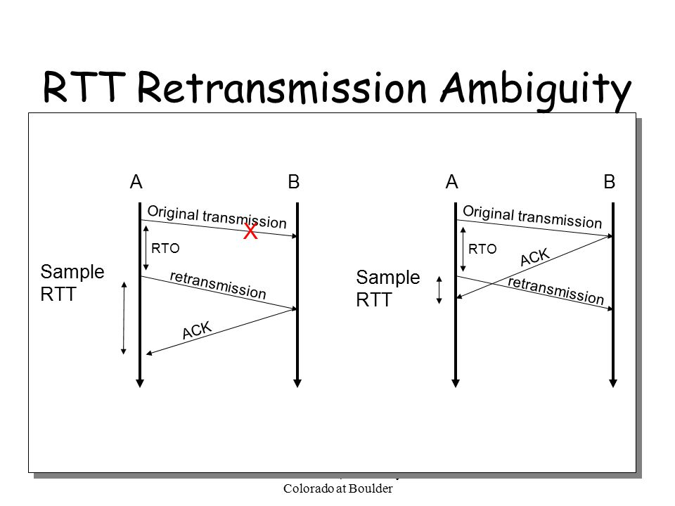
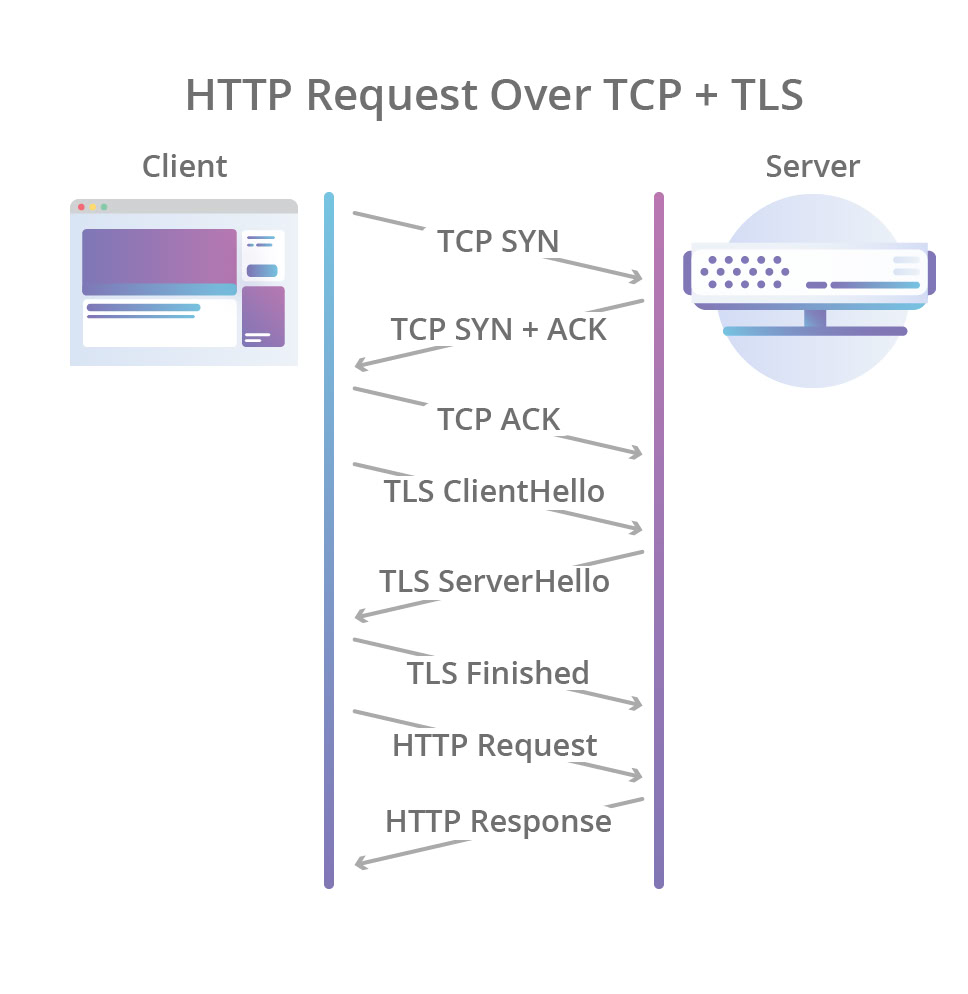
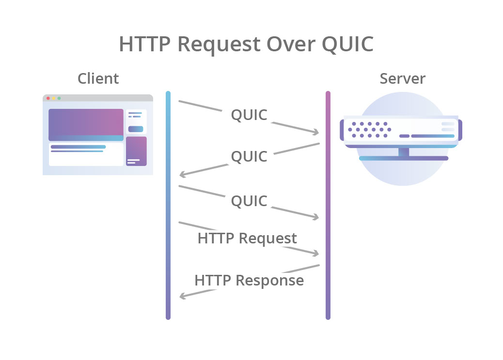

# Сети 2
Сегодня подробнее поговорим про разные протоколы и сетевые технологии.

**Дисклеймер:** большая часть сегодняшнего семинара заимствована из лекций Максима Кочукова по сетям. 
Если хотите лучше разобраться в сетях - возьмите этот курс в следующем семестре :)

## Шифрование
**Виды шифрования:**
* *Симметричное* - для шифровки и расшифровки используется один и тот же ключ
* *Асимметричное* - есть *публичный* ключ для шифровки и *приватный* для расшифровки

Разберем протокол RSA, котррый используется для шифрования сетевого трафика, в т.ч. в протоколах SSH и HTTPS.

**RSA**:
1. Берутся два простых числа $p$ и $q$, вычисляется $N=pq$
2. Вычисляется $\phi(N) = (p - 1)(q - 1)$
3. Фиксируется $e < \phi(N)$ такое, что $gcd(e, \phi(N)) = 1$. Вычисляется $d = e^{-1} mod \phi(N)$
4. Приватный ключ: $(e, N)$
5. Публичный ключ: $(d, N)$
6. Шифрование: $C = M^e mod N$
7. Расшифровка: $M = C^d mod N$

**Diffie-Hellman key exchange** - алгоритм для безопасного обмена ключами с помощью публичного канала.
Идейно, есть два участника процесса - A и B, они договориваются об общей (публичной) информации *i*, а потом каждый фиксирует свой локальный (приватный) ключ (*a* и *b* соответственно).
Далее A пересылает B значение некоторой функции $g(i, a)$, а B пересылает A $g(i, b)$. 
Далее каждый вычисляет общий секрет $s = f(a, g(i, b)) = f(b, g(i, a))$ (понятно, что функции f и g должны быть подобраны специальным образом).

### SSL and TLS
На практике для установки безопасных соединений исользуются протоклы SSL и TLS (Security Layer).
Изначально использовался SSL, но в нем было найдено несколько уязвимостей и он был признан устаревшим, поэтому сейчас не используется.

TLS использует систему **сертификатов** - электронных документов, подтверждающих валидность некоторого публичного ключа.
Сертификат содержит информацию о том, кто его выдал, а так же электронную подпись.
Выстраиваются в цепочки, в начале каждой из которых стоят корневые сертификаты, которым доверяет весь интернет.

## HTTP
**HTTP (Hypertext Transfer Protocol** - application layer протокол, используемый в основном для загрузки веб-страниц с помощью гиперссылок.
Первой широко используемой версией HTTP была версия HTTP/1.1. Сейчас чаще используется HTTP/2.

**Достоинства HTTP/2:**
* *Multiplexing* - HTTP/1.1 загружает части страницы одну за другой, и если какая-то часть не доступна, то возникает проблема head-of-line blocking. HTTP/2 решает эту проблему, используя одно TCP-соединение для того, чтобы посылать несколько параллельных спотоков данных.
  Для этого HTTP/2 разбивает данные на сообщения в бинарном формате и нумерует их так, чтобы клиент мог понять, из какого потока пришли данные
* *Prioritization* - HTTP/2 сначала подгружает более значимую часть страницы (текс, ссылки), а потом - менее значимую (например, картинки, стили)
* *Server push* - сервер, использующий HTTP/2, может отослать клиенту данные до того, как клиент их запросит
* *Header compression* - HTTP/1.1 сжимает пересылаемые сообщения для того, чтобы ускорить отправку. HTTP/2 так же сжимает заголовок

## QUIC
На прошлом занятии мы говорили про TCP - протокол транспортного уровня, нужный для поддержания абстракции непрерывного потока данных, передаваемого от одного приложения к другому.

**Недостатки TCP**:
* *Retransmission ambiguity* - невозможность однозначно определить, когда есть необходимость повторной отправки пакета.
* *Head of line blocking* - невозможность отправить новый пакет, если предыдущий не был доставлен
* *Ossification* - многие современные устройства (в частности, роутеры), занимаются парсингом заголовка TCP, поэтому вносить существенные изменения в протокол не представляется возможным
* *Hand shake latency* - как мы помним, для установки TCP-соединения нужно провести хэндшейк: сначала клиент посылает серверу SYN, потом сервер посылает SYN ACK, потом клиент посылает серверу ACK. Это занимает время, равное 1,5 RTT
 

Решение - **QUIC**. Это протокол, который работает поверх UDP и оперирует на трех уровнях модели OSI: Application, Security, Transport.

**Достоинства QUIC:**
* **Faster handshake:** на установку соединения с помощью TCP+TLS требовалось 2,5 RTT, для установки QUIC соединения нужно 1 RTT (см. картинки)
* **Multiplexing:** мультиплексирование позволяет использовать несколько параллельных каналов внутри одного QUIC-соединения для отправки сообщений, что решает проблему head-of-line blocking
* **Header encryption:** шифрование полей заголовка (номера пакета, фрейма, ACK, Window, Options) помогает избежать оссификации

**Недостатки QUIC:**
* Код в userspace - до 2х CPU по сравнению с TCP
* Не дает прироста в производительности в low-latency, low-loss сетях

**Вопрос на подумать:** почему только Google могли внедрить QUIC?
